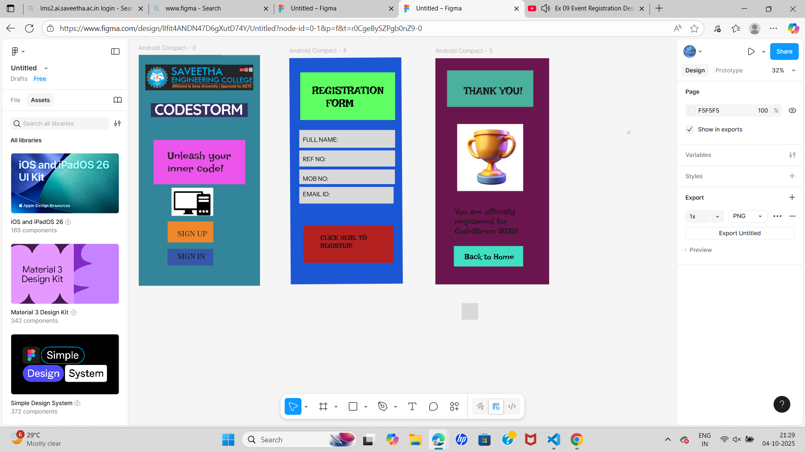

# Ex09 Event Registration Web Application
## Date:7.10.2025

## AIM:
To design, develop and deploy a web application for event registration.

## DESIGN STEPS:

### Step 1:
Create a new frame.

### Step 2:
Select any one preset size of your choice.

### Step 3:
Select the shapes you need.

### Step 4:
Import images as needed.

### Step 5:
Create pages based on your need and link them.

### Step 6:

Validate the HTML and CSS code.

### Step 6:

Publish the website in the given URL.

## DESIGN TOOL:
Figma

## CODE:
```
index.html
<!DOCTYPE html>
<html>
  <head>
    <meta name="viewport" content="width=device-width, initial-scale=1" />
    <meta charset="utf-8" />
    <link rel="stylesheet" href="globals.css" />
    <link rel="stylesheet" href="style.css" />
  </head>
  <body>
    <div class="android-compact">
      
      
      
      <div class="rectangle"></div>
      <div class="unleash-your-inner">Unleash your<br />inner code</div>
      
      
      <div class="text-wrapper">SIGN UP</div>
      
      
      <div class="div"></div>
      <div class="text-wrapper-2">SIGN IN</div>
      
    </div>
  </body>
</html>

style.css
.android-compact {
  background-color: #338698;
  overflow: hidden;
  width: 100%;
  min-width: 729px;
  min-height: 1389px;
  position: relative;
}

.android-compact .screenshot {
  position: absolute;
  top: 58px;
  left: 40px;
  width: 648px;
  height: 154px;
  aspect-ratio: 4.21;
  object-fit: cover;
}

.android-compact .img {
  position: absolute;
  top: 290px;
  left: 73px;
  width: 582px;
  height: 83px;
  aspect-ratio: 7.02;
  object-fit: cover;
}

.android-compact .text-on-a-path {
  position: absolute;
  top: 2603px;
  left: 571px;
  width: 545px;
  height: 265px;
}

.android-compact .rectangle {
  position: absolute;
  top: 511px;
  left: 89px;
  width: 551px;
  height: 267px;
  background-color: #ec53ec;
}

.android-compact .unleash-your-inner {
  position: absolute;
  top: 567px;
  left: 173px;
  font-family: "Irish Grover-Regular", Helvetica;
  font-weight: 400;
  color: #212020;
  font-size: 64px;
  letter-spacing: 0;
  line-height: normal;
}

.android-compact .text-on-a-path-2 {
  position: absolute;
  top: 3024px;
  left: 708px;
  width: 309px;
  height: 126px;
}

.android-compact .rectangle-2 {
  position: absolute;
  top: 1002px;
  left: 174px;
  width: 274px;
  height: 126px;
}

.android-compact .text-wrapper {
  top: 1045px;
  color: #242121;
  position: absolute;
  left: 233px;
  font-family: "Inria Serif-Regular", Helvetica;
  font-weight: 400;
  font-size: 48px;
  letter-spacing: 0;
  line-height: normal;
}

.android-compact .text-on-a-path-3 {
  position: absolute;
  top: 3182px;
  left: 991px;
  width: 291px;
  height: 107px;
}

.android-compact .text-on-a-path-4 {
  position: absolute;
  top: 3182px;
  left: 695px;
  width: 296px;
  height: 124px;
}

.android-compact .div {
  position: absolute;
  top: 1167px;
  left: 173px;
  width: 275px;
  height: 100px;
  background-color: #3757a8;
}

.android-compact .text-wrapper-2 {
  top: 1181px;
  color: #121111;
  position: absolute;
  left: 233px;
  font-family: "Inria Serif-Regular", Helvetica;
  font-weight: 400;
  font-size: 48px;
  letter-spacing: 0;
  line-height: normal;
}

.android-compact .screenshot-2 {
  position: absolute;
  top: 799px;
  left: 197px;
  width: 251px;
  height: 169px;
  aspect-ratio: 1.49;
  object-fit: cover;
}
 page2
 index.html
 <!DOCTYPE html>
<html>
  <head>
    <meta name="viewport" content="width=device-width, initial-scale=1" />
    <meta charset="utf-8" />
    <link rel="stylesheet" href="globals.css" />
    <link rel="stylesheet" href="style.css" />
  </head>
  <body>
    <div class="android-compact">
      <div class="rectangle"></div>
      <div class="REGISTRATION-FORM">REGISTRATION<br />&nbsp;&nbsp;&nbsp;&nbsp;FORM</div>
      <div class="div"></div>
      
      
      
      
      <div class="rectangle-2"></div>
      <div class="text-wrapper">FULL NAME:</div>
      
      
      
      <div class="rectangle-4"></div>
      <div class="text-wrapper-2">REF NO:</div>
      <div class="rectangle-5"></div>
      
      
      
      
      
      <div class="rectangle-8"></div>
      <div class="text-wrapper-3">MOB NO:</div>
      
      
      
      <div class="rectangle-10"></div>
      <div class="text-wrapper-4">EMAIL ID:</div>
      
      <div class="rectangle-11"></div>
      <div class="CLICK-HERE-TO">CLICK HERE TO<br />REGISTER</div>
    </div>
  </body>
</html>
 style.css
 .android-compact {
  position: relative;
  width: 683px;
  height: 1367px;
  background-color: #1a55d4;
  overflow: hidden;
}

.android-compact .rectangle {
  top: 88px;
  left: 65px;
  width: 570px;
  height: 287px;
  background-color: #5fff64;
  position: absolute;
  transform: rotate(0.39deg);
}

.android-compact .REGISTRATION-FORM {
  position: absolute;
  top: 158px;
  left: 137px;
  transform: rotate(0.39deg);
  font-family: "Irish Grover-Regular", Helvetica;
  font-weight: 400;
  color: #000000;
  font-size: 64px;
  letter-spacing: 0;
  line-height: normal;
}

.android-compact .div {
  top: 464px;
  left: 78px;
  width: 16px;
  height: 10px;
  background-color: #d9d9d9;
  position: absolute;
  transform: rotate(0.39deg);
}

.android-compact .img {
  top: 3137px;
  left: 742px;
  width: 100px;
  height: 100px;
  position: absolute;
  transform: rotate(0.39deg);
}

.android-compact .text-on-a-path {
  position: absolute;
  top: 2527px;
  left: -340px;
  width: 570px;
  height: 100px;
  transform: rotate(0.39deg);
}

.android-compact .text-on-a-path-2 {
  top: 2535px;
  left: -344px;
  width: 574px;
  height: 92px;
  position: absolute;
  transform: rotate(0.39deg);
}

.android-compact .text-on-a-path-3 {
  top: 2541px;
  left: -340px;
  width: 570px;
  height: 107px;
  position: absolute;
  transform: rotate(0.39deg);
}

.android-compact .rectangle-2 {
  top: 435px;
  left: 57px;
  width: 576px;
  height: 107px;
  background-color: #d9d9d9;
  position: absolute;
  transform: rotate(0.39deg);
}

.android-compact .text-wrapper {
  position: absolute;
  top: 470px;
  left: 78px;
  transform: rotate(0.39deg);
  font-family: "Instrument Sans-Regular", Helvetica;
  font-weight: 400;
  color: #000000;
  font-size: 36px;
  letter-spacing: 0;
  line-height: normal;
}

.android-compact .rectangle-3 {
  top: 2825px;
  left: 661px;
  width: 100px;
  height: 100px;
  position: absolute;
  transform: rotate(0.39deg);
}

.android-compact .text-on-a-path-4 {
  top: 2684px;
  left: -343px;
  width: 570px;
  height: 100px;
  position: absolute;
  transform: rotate(0.39deg);
}

.android-compact .text-on-a-path-5 {
  top: 2664px;
  left: -339px;
  width: 567px;
  height: 97px;
  position: absolute;
  transform: rotate(0.39deg);
}

.android-compact .rectangle-4 {
  top: 558px;
  left: 56px;
  width: 576px;
  height: 97px;
  background-color: #d9d9d9;
  position: absolute;
  transform: rotate(0.39deg);
}

.android-compact .text-wrapper-2 {
  position: absolute;
  top: 587px;
  left: 77px;
  transform: rotate(0.39deg);
  font-family: "Instrument Sans-Regular", Helvetica;
  font-weight: 400;
  color: #000000;
  font-size: 36px;
  letter-spacing: 0;
  line-height: normal;
}

.android-compact .rectangle-5 {
  top: 715px;
  left: 55px;
  width: 9px;
  height: 25px;
  background-color: #d9d9d9;
  position: absolute;
  transform: rotate(0.39deg);
}

.android-compact .text-on-a-path-6 {
  top: 2787px;
  left: -341px;
  width: 567px;
  height: 100px;
  position: absolute;
  transform: rotate(0.39deg);
}

.android-compact .text-on-a-path-7 {
  top: 2785px;
  left: -349px;
  width: 575px;
  height: 100px;
  position: absolute;
  transform: rotate(0.39deg);
}

.android-compact .text-on-a-path-8 {
  top: 2782px;
  left: 229px;
  width: 572px;
  height: 98px;
  position: absolute;
  transform: rotate(0.39deg);
}

.android-compact .rectangle-6 {
  top: 3144px;
  left: 1425px;
  width: 100px;
  height: 100px;
  position: absolute;
  transform: rotate(0.39deg);
}

.android-compact .rectangle-7 {
  top: 3247px;
  left: 1411px;
  width: 100px;
  height: 100px;
  position: absolute;
  transform: rotate(0.39deg);
}

.android-compact .rectangle-8 {
  top: 673px;
  left: 55px;
  width: 575px;
  height: 88px;
  background-color: #d9d9d9;
  position: absolute;
  transform: rotate(0.39deg);
}

.android-compact .text-wrapper-3 {
  position: absolute;
  top: 705px;
  left: 76px;
  transform: rotate(0.39deg);
  font-family: "Instrument Sans-Regular", Helvetica;
  font-weight: 400;
  color: #000000;
  font-size: 36px;
  letter-spacing: 0;
  line-height: normal;
}

.android-compact .text-on-a-path-9 {
  top: 2887px;
  left: -348px;
  width: 570px;
  height: 101px;
  position: absolute;
  transform: rotate(0.39deg);
}

.android-compact .rectangle-9 {
  top: 3101px;
  left: 818px;
  width: 100px;
  height: 100px;
  position: absolute;
  transform: rotate(0.39deg);
}

.android-compact .text-on-a-path-10 {
  top: 2890px;
  left: -342px;
  width: 558px;
  height: 94px;
  position: absolute;
  transform: rotate(0.39deg);
}

.android-compact .rectangle-10 {
  top: 778px;
  left: 55px;
  width: 567px;
  height: 100px;
  background-color: #d9d9d9;
  position: absolute;
  transform: rotate(0.39deg);
}

.android-compact .text-wrapper-4 {
  position: absolute;
  top: 798px;
  left: 76px;
  transform: rotate(0.39deg);
  font-family: "Instrument Sans-Regular", Helvetica;
  font-weight: 400;
  color: #000000;
  font-size: 36px;
  letter-spacing: 0;
  line-height: normal;
}

.android-compact .text-on-a-path-11 {
  top: 3114px;
  left: -326px;
  width: 539px;
  height: 180px;
  position: absolute;
  transform: rotate(0.39deg);
}

.android-compact .rectangle-11 {
  top: 1008px;
  left: 77px;
  width: 543px;
  height: 227px;
  background-color: #b32121;
  position: absolute;
  transform: rotate(0.39deg);
}

.android-compact .CLICK-HERE-TO {
  position: absolute;
  top: 1060px;
  left: 181px;
  transform: rotate(0.39deg);
  font-family: "Irish Grover-Regular", Helvetica;
  font-weight: 400;
  color: #161414;
  font-size: 40px;
  letter-spacing: 0;
  line-height: normal;
}
 page3
index.html
<!DOCTYPE html>
<html>
  <head>
    <meta name="viewport" content="width=device-width, initial-scale=1" />
    <meta charset="utf-8" />
    <link rel="stylesheet" href="globals.css" />
    <link rel="stylesheet" href="style.css" />
  </head>
  <body>
    <div class="android-compact">
      <div class="rectangle"></div>
      <div class="text-wrapper">THANK YOU!</div>
      
      <p class="you-are-officially">You are officially <br />registered for<br />CodeStrom 2025!</p>
      <div class="div"></div>
    </div>
  </body>
</html>
 style.css

.android-compact {
  background-color: #6a144e;
  width: 100%;
  min-width: 684px;
  min-height: 1362px;
  position: relative;
}

.android-compact .rectangle {
  position: absolute;
  top: 73px;
  left: 70px;
  width: 519px;
  height: 220px;
  background-color: #4bb09c;
}

.android-compact .text-wrapper {
  position: absolute;
  top: 158px;
  left: 171px;
  width: 396px;
  font-family: "Irish Grover-Regular", Helvetica;
  font-weight: 400;
  color: #171616;
  font-size: 64px;
  letter-spacing: 0;
  line-height: normal;
}

.android-compact .screenshot {
  position: absolute;
  top: 396px;
  left: 131px;
  width: 397px;
  height: 404px;
  aspect-ratio: 0.98;
  object-fit: cover;
}

.android-compact .you-are-officially {
  position: absolute;
  top: 895px;
  left: 117px;
  font-family: "Irish Grover-Regular", Helvetica;
  font-weight: 400;
  color: #1a1919;
  font-size: 48px;
  letter-spacing: 0;
  line-height: normal;
}

.android-compact .div {
  position: absolute;
  top: 1131px;
  left: 111px;
  width: 417px;
  height: 123px;
  background-color: #41dec1;
}

```


## OUTPUT:



## RESULT:
The program to design, develop and deploy a web application for event registration is completed successfully.

